# Nexora ERP

Full-stack ERP platform covering CRM, catalog, sales, invoicing, payments, inventory, analytics, and administration. A Laravel 12 REST API serves a React 19 + TypeScript single-page dashboard.

```
Nexora-ERP/
├── Backend/    Laravel 12 API (PHP 8.3, Sanctum, MySQL, Pest)
└── Frontend/   React 19 SPA (Vite 8, TypeScript, Oxlint)
```

## Table of contents

- [Architecture](#architecture)
- [Screenshots](#screenshots)
- [Requirements](#requirements)
- [Installation](#installation)
- [Running the application](#running-the-application)
- [Authentication](#authentication)
- [API reference](#api-reference)
- [Business rules](#business-rules)
- [Data model](#data-model)
- [Frontend](#frontend)
- [Testing](#testing)
- [Project layout](#project-layout)
- [Known gaps](#known-gaps)

## Architecture

The frontend is a stateless SPA. It authenticates with a Sanctum bearer token held in `localStorage` and sends it as `Authorization: Bearer <token>`. In development, Vite proxies `/api` to the Laravel server, so both run on `localhost` with no CORS handshake in the common case.

```
Browser ──► Frontend :5173
              │  fetch /api/v1/...  (dev proxy)
              ▼
           Backend :8000  ──► MySQL
```

Authorization is a two-role model enforced by middleware. `active` rejects disabled accounts on every authenticated request; `role:administrator` gates administrative routes. There are no policies, Form Request classes, or API Resources — validation is inline per controller.

Two cross-cutting services handle observability and alerts. `App\Services\AuditLogger` records every mutation with the acting user, entity, IP, and a JSON detail payload. `App\Services\BusinessNotifier` pushes a database notification to all active administrators on events like `new_order`, `low_stock`, and `payment_received`.

All monetary columns are `DECIMAL(12,3)` to hold three-decimal currency precision. Order and invoice numbers are generated by the API, not the database: `ORD-YYYYMMDD-XXXXXX` and `INV-YYYYMMDD-XXXXXX`, where the suffix is six uppercase hex characters.

## Screenshots

Captured from a running instance at 1440x900, signed in as an administrator. The dataset behind them is demo data created through the public API: 6 categories, 19 products, 11 customers, 5 staff accounts, 20 orders spread across the last ten months, 16 invoices with payments, 67 stock movements, 40 notifications, and 164 audit entries. Nothing in the screenshots is hardcoded in the frontend; every number comes from the API.

### Sign in

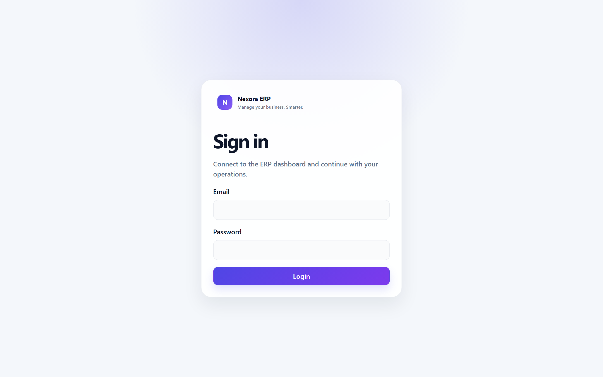

### Dashboard

Revenue, orders, customers, and outstanding balance as KPI cards, with 30-day sales and recent activity below.

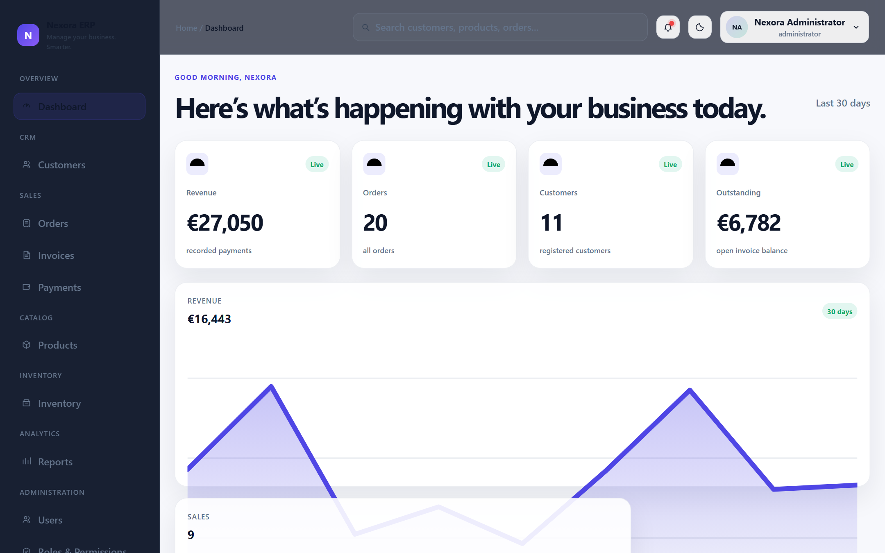

The same view in dark theme. The theme is a `data-theme` attribute on `<html>`, persisted per browser.

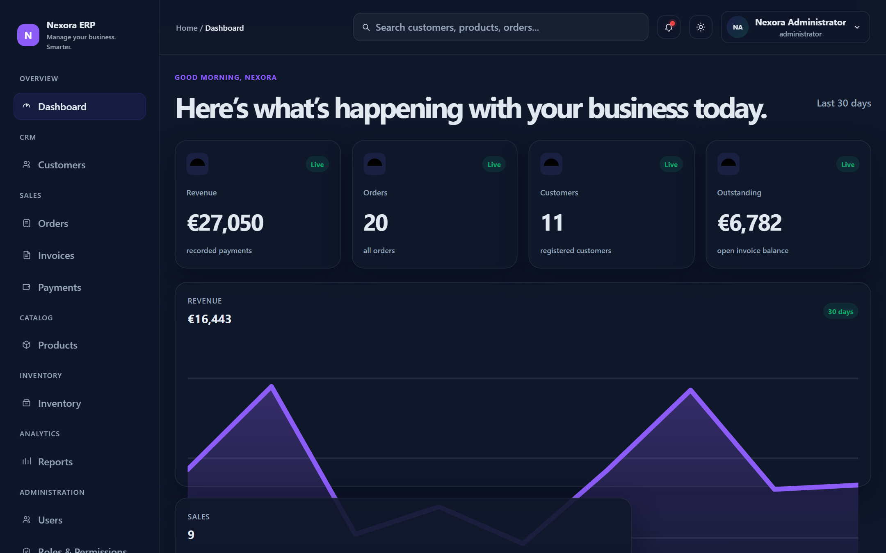

### CRM and catalog

| Customers | Products |
| --- | --- |
| 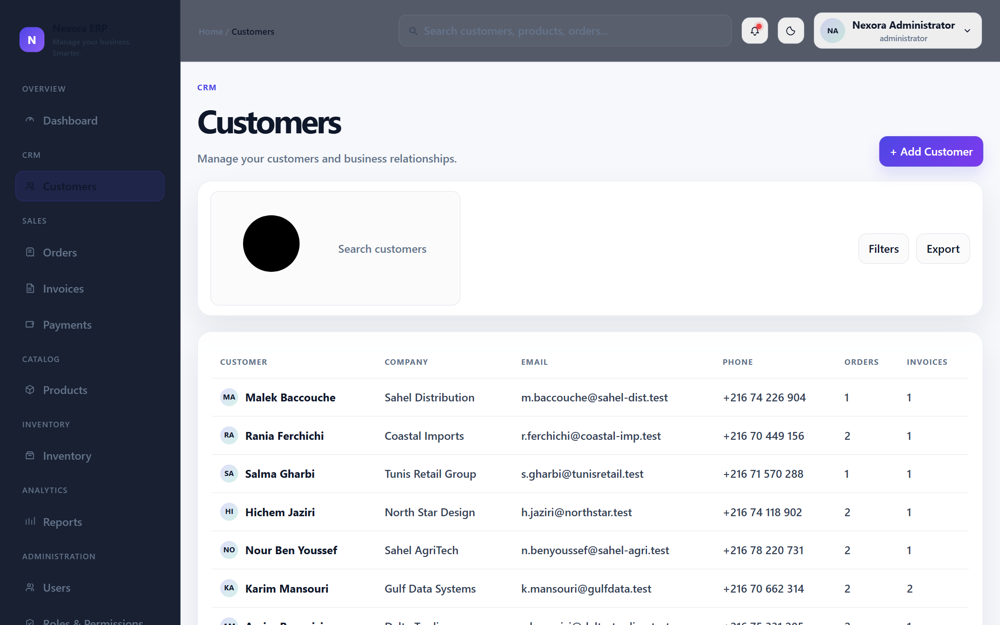 | 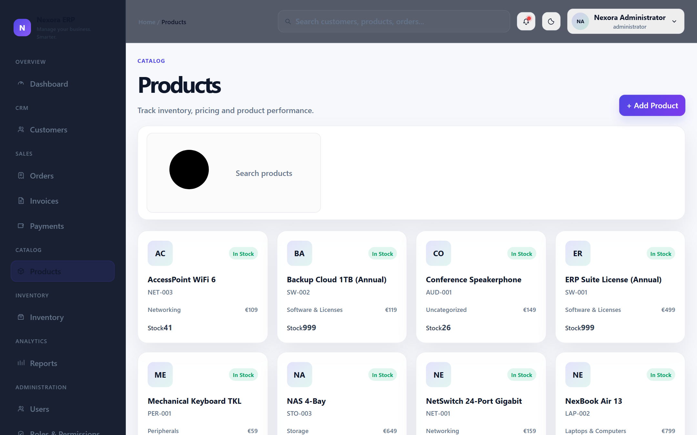 |

### Sales

| Orders | Invoices |
| --- | --- |
| 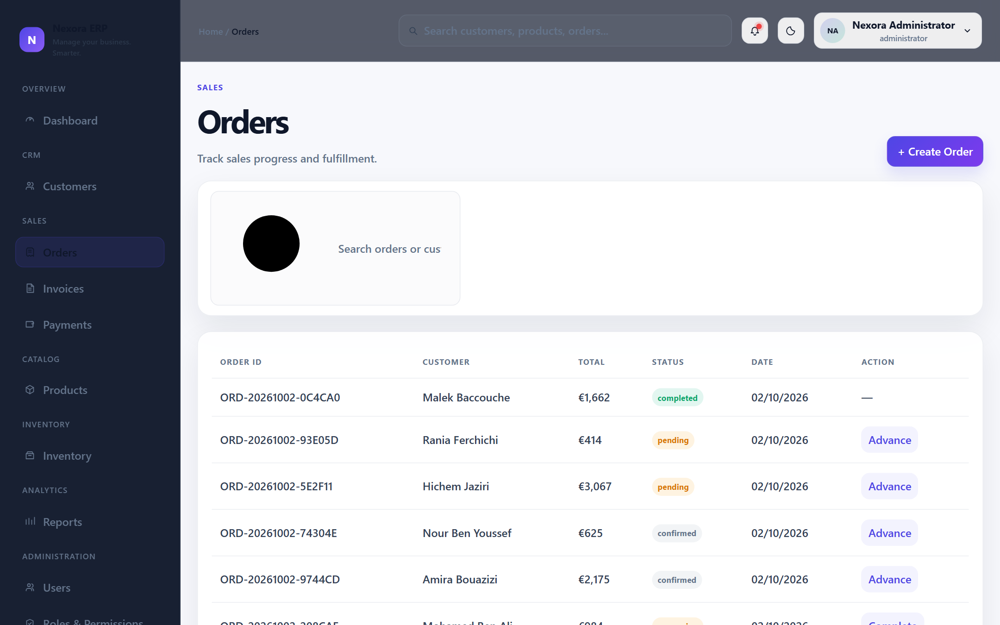 | 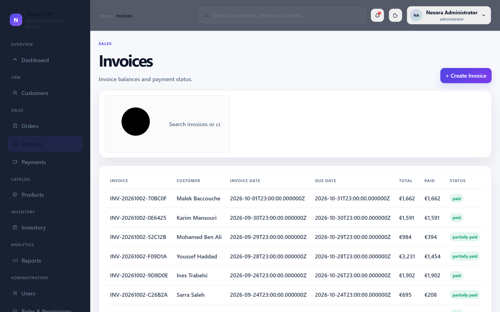 |

| Payments | Inventory |
| --- | --- |
| 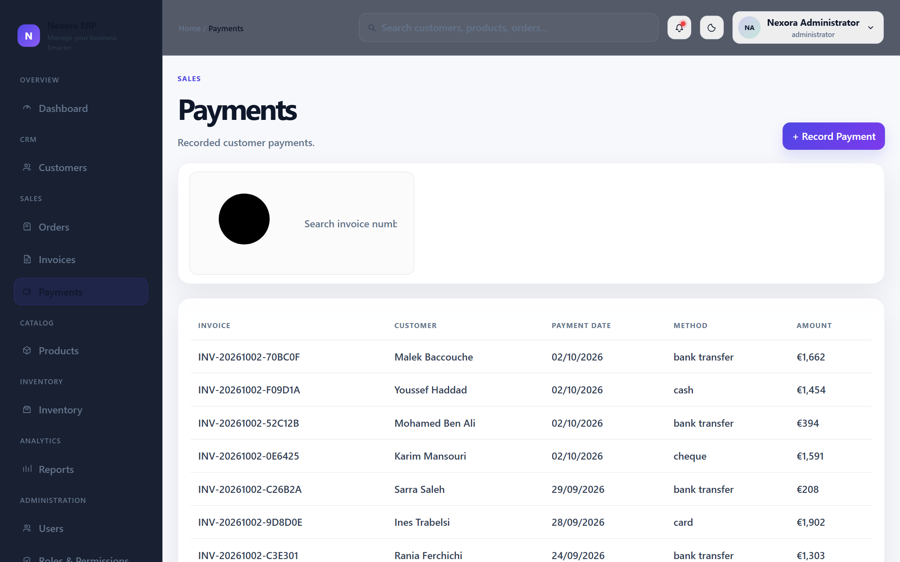 | 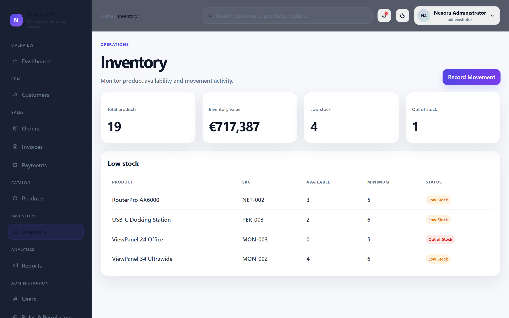 |

### Analytics and administration

| Reports | Users |
| --- | --- |
| 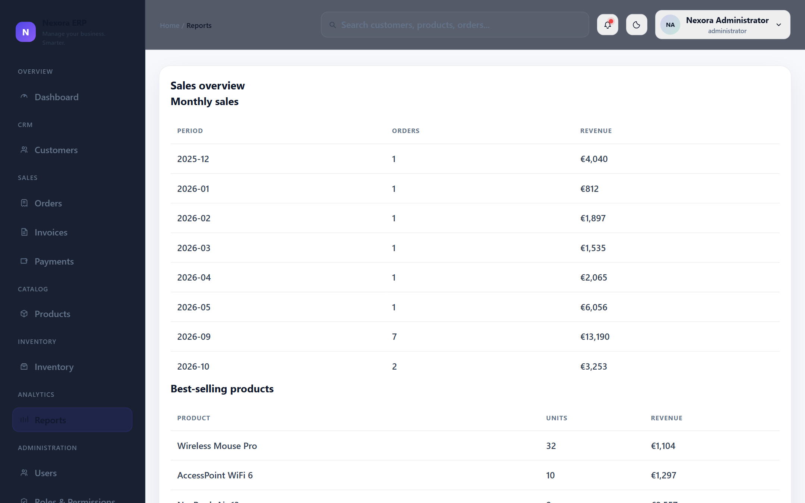 | 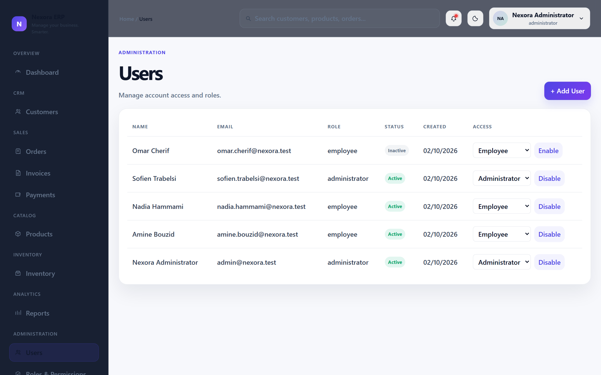 |

| Audit logs | Settings |
| --- | --- |
| 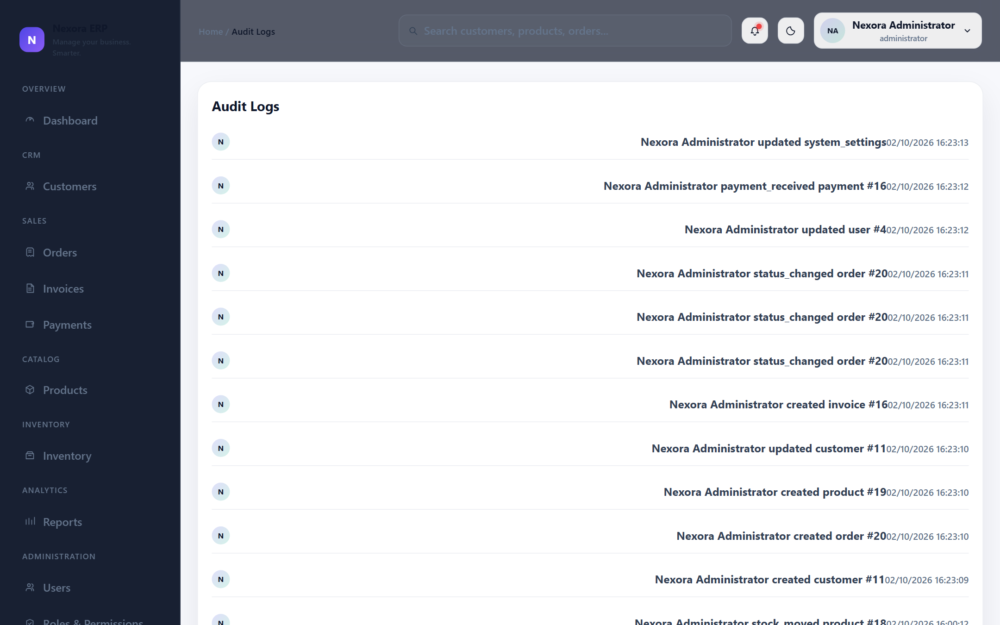 | 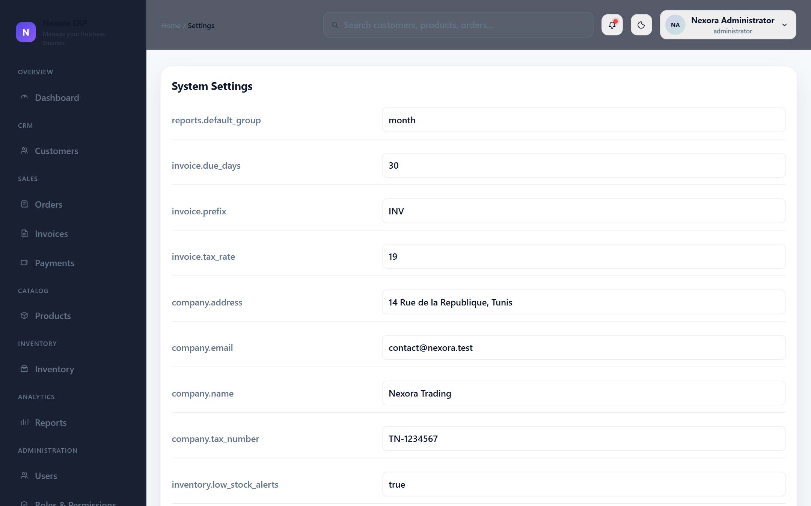 |

`Roles & Permissions` is a static matrix in the UI and is documented under [Known gaps](#known-gaps) rather than shown here.

### Notifications

Administrator alerts for low stock, new orders, and received payments, written to the database notification channel by `App\Services\BusinessNotifier`.

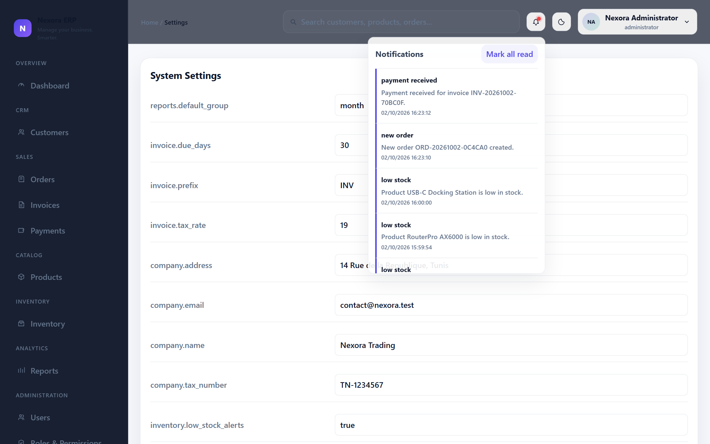

## Requirements

Backend:

- PHP 8.3+ with `pdo_mysql`, `mbstring`, `openssl`, `tokenizer`, `xml`, `ctype`, `fileinfo`, `json`
- Composer 2
- MySQL 8+

Frontend:

- Node.js 20+
- npm

## Installation

### Backend

```powershell
cd Backend
composer install
Copy-Item .env.example .env
php artisan key:generate
```

Set the database and admin credentials in `.env`:

```dotenv
DB_DATABASE=nexora_erp
DB_USERNAME=root
DB_PASSWORD=

ADMIN_NAME="Nexora Administrator"
ADMIN_EMAIL=admin@nexora.test
ADMIN_PASSWORD=your-secure-password
```

Then create the schema and the first administrator:

```powershell
php artisan migrate
php artisan db:seed
```

`composer setup` chains install, env copy, key generation, and migration, but it does not seed. The seeder throws if `ADMIN_EMAIL` or `ADMIN_PASSWORD` is empty, so it must run after those are set.

As an alternative to migrations, import `database/nexora_erp.sql` directly into MySQL. The two paths are mutually exclusive: the SQL file does not register the migration in Laravel's `migrations` table, so running `php artisan migrate` afterwards fails with "table already exists".

### Frontend

```powershell
cd Frontend
npm install
```

## Running the application

Two terminals:

```powershell
cd Backend && php artisan serve      # http://localhost:8000
cd Frontend && npm run dev           # http://localhost:5173
```

The Vite dev server binds `0.0.0.0:5173` and proxies `/api` to `http://localhost:8000`. The backend health check is available at `GET /up`.

For scheduled work, run the scheduler in a third terminal. It flips past-due open invoices to `overdue` and alerts administrators, daily at 00:15:

```powershell
cd Backend && php artisan schedule:work
```

Production builds:

```powershell
cd Frontend && npm run build     # tsc -b && vite build → dist/
```

Serve `dist/` from any static host and point it at the deployed API. CORS is configured from a single origin, `FRONTEND_URL`, with credentials allowed.

## Authentication

Public endpoints live under `POST /api/v1` and are rate limited: login and register allow 5 requests per minute, password reset requests 3 per minute.

Public registration always creates an `employee`. There is no way to self-register as an administrator; only an existing administrator can assign elevated roles through `POST /api/v1/users`.

Obtain a token:

```bash
curl -X POST http://localhost:8000/api/v1/login \
  -H 'Content-Type: application/json' \
  -H 'Accept: application/json' \
  -d '{"email":"admin@nexora.test","password":"your-secure-password"}'
```

The response contains `token` and `user`. Send the token on every subsequent request:

```
Authorization: Bearer <token>
```

Logout revokes only the current token. Changing a password or resetting one revokes all of the user's tokens, signing out every device. Disabling a user through the admin API also revokes their tokens.

Failed logins return a single generic 422 message for unknown email, wrong password, and disabled account alike.

## API reference

Base path: `/api/v1`. Every route below except the four public auth routes requires `auth:sanctum` and an active account.

### Authentication

| Method | Path | Notes |
| --- | --- | --- |
| POST | `/register` | Public. Always returns an employee. |
| POST | `/login` | Public. Returns `{user, token}`. |
| POST | `/forgot-password` | Public. Always returns 200 regardless of account existence. |
| POST | `/reset-password` | Public. Revokes all tokens on success. |
| POST | `/logout` | Revokes the current token. |
| GET | `/user` | Current user. |
| PUT | `/profile` | Update name and email. |
| PUT | `/profile/password` | Requires `current_password`; revokes all tokens. |

### Dashboard and reports

| Method | Path | Access |
| --- | --- | --- |
| GET | `/dashboard` | Any active user |
| GET | `/reports/sales` | Any active user |
| GET | `/reports/products` | Administrator |
| GET | `/reports/customers` | Administrator |
| GET | `/reports/finance` | Administrator |

`/dashboard` returns KPIs (revenue from all recorded payments, order and customer counts, open invoice balance, low-stock count), 30 days of daily sales, 12 months of revenue, top products by units sold, and recent orders, payments, invoices, and low stock. Administrators additionally get the last 10 audit entries under `recent_activity`; that key is absent for employees.

`/reports/sales` accepts `from`, `to`, and `group` (`day`, `week`, `month`) and counts completed orders only. Weeks use ISO-8601 format (`2026-W42`).

### CRM

| Method | Path | Access |
| --- | --- | --- |
| GET | `/customers` | Any active user |
| POST | `/customers` | Any active user |
| GET | `/customers/{id}` | Any active user |
| PUT, PATCH | `/customers/{id}` | Any active user |
| DELETE | `/customers/{id}` | Administrator |

List parameters: `search` (first name, last name, company, or email), `sort` (`first_name`, `last_name`, `company`, `created_at`), `direction`, `per_page` (1–100, default 15). Each row carries `orders_count` and `invoices_count`. The detail endpoint adds `payments_sum_amount` plus the 10 most recent orders, invoices, and payments.

Deleting a customer with orders or invoices returns 409.

### Catalog

| Method | Path | Access |
| --- | --- | --- |
| GET | `/categories` | Any active user |
| GET | `/categories/{id}` | Any active user |
| POST | `/categories` | Administrator |
| PUT, PATCH | `/categories/{id}` | Administrator |
| DELETE | `/categories/{id}` | Administrator |

Category listing is fixed at 50 per page and includes `products_count`. Deleting a category that still has products returns 409.

| Method | Path | Access |
| --- | --- | --- |
| GET | `/products` | Any active user |
| POST | `/products` | Any active user |
| GET | `/products/{id}` | Any active user |
| PUT, PATCH | `/products/{id}` | Any active user |
| DELETE | `/products/{id}` | Administrator |

List parameters: `search` (name or SKU), `category_id`, `status` (`active`/`inactive`), `stock_status` (`low` for at or below the minimum threshold, `available` for above zero), `sort` (`name`, `sku`, `selling_price`, `stock_quantity`, `created_at`), `direction`, `per_page`. An unrecognized sort field returns 422.

Creating a product with opening stock also writes an `in` inventory movement labelled "Initial stock", and warns administrators if the resulting level is already at or below the minimum. `stock_quantity` is rejected on update (`prohibited`) — stock only moves through inventory movements or order completion. Deleting a product referenced by stock history or orders returns 409.

### Sales

| Method | Path | Access |
| --- | --- | --- |
| GET | `/orders` | Any active user |
| POST | `/orders` | Any active user |
| GET | `/orders/{id}` | Any active user |
| PATCH | `/orders/{id}/status` | Any active user |
| GET | `/invoices` | Any active user |
| POST | `/invoices` | Any active user |
| GET | `/invoices/{id}` | Any active user |
| GET | `/payments` | Any active user |
| POST | `/payments` | Any active user |

Orders support `search` (order number or customer name), `status`, `from`, `to`, `per_page`. Creating an order takes `customer_id` and an `items` array of `{product_id, quantity, discount?, tax_rate?}`, with an optional order-level `discount`. Item rows snapshot `product_name`, `sku`, and `unit_price`, so later catalog edits do not rewrite order history.

Invoices accept `search`, `status`, `from`/`to` on `invoice_date`, `per_page`, and include `payments_sum_amount`. Payments accept `search` (invoice number), `method`, `from`/`to` on `payment_date`, `per_page`.

Orders cannot be edited or deleted after creation. Invoices and payments are read-and-create only; invoice status is derived.

### Inventory

| Method | Path | Access |
| --- | --- | --- |
| GET | `/inventory` | Any active user |
| GET | `/inventory/movements` | Any active user |
| POST | `/inventory/movements` | Administrator |

`/inventory` lists products with their stock levels, not movement records. It accepts `search`, `low_stock`, and `per_page`. `/inventory/movements` is the history feed, accepting `product_id`, `type`, and `per_page` (default 20).

### Administration

| Method | Path | Access |
| --- | --- | --- |
| GET, POST | `/users` | Administrator |
| GET, PUT, PATCH, DELETE | `/users/{id}` | Administrator |
| GET | `/audit-logs` | Administrator |
| GET | `/settings` | Administrator |
| PUT | `/settings` | Administrator |

Users list supports `search`, `role`, `per_page`. Audit logs support `action`, `entity`, `user_id`, `from`, `to`, `per_page` (default 25). Settings return a flat, unpaginated array; updates take a `settings` array of `{key, value, group?}` and upsert by key.

### Notifications

| Method | Path | Access |
| --- | --- | --- |
| GET | `/notifications` | Any active user |
| PATCH | `/notifications/read-all` | Any active user |
| PATCH | `/notifications/{id}/read` | Any active user |

`GET /notifications` returns `{unread_count, notifications}`. Marking a notification read is scoped to the caller, so another user's notification id returns 404.

### Response conventions

List endpoints return the standard Laravel paginator envelope with `data`, `current_page`, `last_page`, `total`, and `per_page`. `per_page` is clamped to 1–100.

| Status | Meaning |
| --- | --- |
| 201 | Created |
| 200 | Success |
| 204 | Deleted |
| 401 | Missing or invalid token |
| 403 | Inactive account, or role gate failed |
| 404 | Record not found, or not visible to the caller |
| 409 | Business conflict, such as deleting a referenced record |
| 422 | Validation failure, or a rejected business rule |

Errors return `{message, errors?}`. Conflict responses (409) carry only `message`.

## Business rules

### Order lifecycle

```
pending ──► confirmed ──► processing ──► completed
   │            │             │
   └────────────┴─────────────┴────────► cancelled
```

`completed` and `cancelled` are terminal. Any other transition is rejected with 422.

Stock is validated when an order is created but not deducted. Deduction happens on `completed`: each product is re-locked, stock is decremented, and an `out` movement is recorded. Insufficient stock at completion time fails the transition. After completion, any product that has fallen to or below its minimum level alerts administrators.

Cancelling an order whose invoice already has a payment returns 422. Otherwise the linked invoice is cancelled too.

### Invoicing and payment

An invoice can only be created for an order that is neither `pending` nor `cancelled`, and each order accepts exactly one invoice — enforced by a unique index on `invoices.order_id`. `due_date` defaults to 30 days after `invoice_date` and cannot precede it.

Payments are validated against the invoice's remaining balance under a row lock, so concurrent submissions cannot overpay. Recording a payment recomputes invoice status:

| Condition | Result |
| --- | --- |
| Paid total ≥ invoice total | `paid` |
| Paid total > 0, past due date | `overdue` |
| Paid total > 0, not past due | `partially_paid` |
| No payments yet | `pending` |

Draft and cancelled invoices reject payments. The `draft` status exists in the schema but no code path writes it.

The `invoices:mark-overdue` command flips `pending` and `partially_paid` invoices past their due date to `overdue` and notifies administrators. It is scheduled daily at 00:15 and must be run via `schedule:work` or a production cron.

### Inventory movements

| Type | `quantity` means | Effect on stock |
| --- | --- | --- |
| `in` | Units added | `stock + quantity` |
| `out` | Units removed | `stock - quantity` |
| `adjustment` | The new absolute level, including zero | `stock = quantity` |
| `transfer` | Units moved | No change |

Non-adjustment movements require at least one unit. Stock can never go negative. An adjustment to the current level is rejected as a no-op. A transfer requires two different non-empty locations. The recorded `quantity` for an adjustment is the absolute difference; `quantity_after` always stores the resulting level.

### Account integrity

At least one active administrator must always remain. Demoting, disabling, or deleting the last active administrator returns 409. Administrators also cannot disable or demote their own account. These checks apply to the admin API and to self-service profile changes.

## Data model

Fourteen tables, created by the single migration `database/migrations/2026_10_01_000000_create_erp_tables.php`.

| Table | Purpose |
| --- | --- |
| `users` | Staff accounts with `role` and `is_active` |
| `password_reset_tokens` | Password reset flow |
| `personal_access_tokens` | Sanctum bearer tokens |
| `customers` | CRM records |
| `categories` | Product groupings |
| `products` | Catalog with pricing, stock, and reorder threshold |
| `orders` / `order_items` | Sales orders with snapshotted line items |
| `invoices` | One per order, derived totals |
| `payments` | Payments against invoices |
| `inventory_movements` | Append-only stock history |
| `audit_logs` | Mutation trail, no `updated_at` |
| `notifications` | Database-channel notifications |
| `system_settings` | Key/value settings grouped by `group` |

Key constraints: `users.email`, `categories.name`, `products.sku`, `orders.order_number`, `invoices.invoice_number`, `invoices.order_id`, and `system_settings.key` are unique. Customers and products with financial or stock history use `RESTRICT` on delete; optional references such as `products.category_id` use `SET NULL`; `order_items` cascade from their order.

There are no `sessions`, `cache`, or `jobs` tables. Sessions and cache are file-backed and the queue runs synchronously, which is fine for local development but means a production deployment needs those services or the corresponding driver settings.

Eloquent models use convention-based table names and plain relationship methods. No model declares a local scope, accessor, or number-generation helper.

## Frontend

Single-page app, no router and no state library. `src/App.tsx` holds all 19 components, all API calls, and all TypeScript response types in one file of roughly 1,660 lines. `src/App.css` adds about 1,195 lines of component styling; `src/index.css` defines the theme tokens.

Pages: dashboard, customers, products, orders, invoices, payments, inventory, reports, users, roles, audit logs, settings.

Data access is two small utilities. `apiFetch` wraps `fetch` with JSON headers, bearer auth, and error unwrapping to `payload.message`. `useApiList` handles paginated list loading with a search term, an `active` guard against stale responses, and a `reload` counter. Dashboard data is fetched once by the root component and passed down.

Auth: the token lives in `localStorage` under `nexora-token`. On any token change the app validates the session with `GET /v1/user`, then loads the dashboard. Any failure clears the token and returns to the login screen. The profile button in the topbar signs out.

Global search debounces 250 ms, requires at least two characters, and queries customers, products, orders, and invoices in parallel with `per_page=4`, merging the results into a single dropdown.

Notifications load once per session with no polling. The bell shows a dot when the unread count is above zero, and individual or bulk read marking writes through to the API.

Theming uses a `data-theme` attribute on `<html>` with `:root` and `:root[data-theme='dark']` token sets in `index.css`. The choice persists under `nexora-theme`, defaulting to the OS preference sampled once at load. The sidebar and topbar use hardcoded dark backgrounds, so they stay dark in both themes.

Both charts are hand-rolled with no charting library. `RevenueChart` is an inline SVG area chart on a `420x180` viewBox with a gradient fill and four gridlines; it has no axis labels, markers, or tooltips. `SalesChart` is a CSS grid of divs with a hardcoded twelve-column track, so it only renders correctly for a twelve-point series.

Build: TypeScript 6 with `noEmit`, `noUnusedLocals`, `noUnusedParameters`, and `verbatimModuleSyntax`. `strict` is not enabled. Linting is Oxlint with two explicit rules, `react/rules-of-hooks` and `react/only-export-components`; lint is not part of the build script.

## Testing

Backend uses Pest 3 with a `Feature` suite at `tests/Feature/ErpWorkflowTest.php`. Run it with:

```powershell
cd Backend
php artisan test
```

Three scenarios are covered: the full order-to-payment workflow including stock deduction and invoice settlement, the role gate blocking employees from user management, and public registration always downgrading to employee.

`phpunit.xml` points tests at an in-memory SQLite database with a fixed app key, cache and session on `array`, and bcrypt rounds at 4. Note that `DashboardController` and `ReportController` use MySQL-only functions such as `DATE_FORMAT` and `DATE`, so those endpoints are not exercisable under the SQLite test configuration. Covering them needs a MySQL test database.

The frontend has no test runner and no test script.

## Project layout

```
Backend/
├── app/
│   ├── Http/Controllers/Api/    14 controllers
│   ├── Http/Middleware/         EnsureUserIsActive, RequireRole
│   ├── Models/                  11 Eloquent models
│   ├── Notifications/           BusinessNotification (database channel)
│   ├── Providers/               AppServiceProvider (empty)
│   └── Services/                AuditLogger, BusinessNotifier
├── bootstrap/app.php            Routing and middleware aliases
├── config/                      cors.php pins FRONTEND_URL
├── database/
│   ├── migrations/              Single migration, 14 tables
│   ├── seeders/                 Admin account from env
│   └── nexora_erp.sql           Standalone MySQL import
├── routes/
│   ├── api.php                  All endpoints under /v1
│   └── console.php              invoices:mark-overdue + schedule
└── tests/Feature/               Pest workflow tests

Frontend/
├── src/
│   ├── App.tsx                  Entire SPA: components, API, types
│   ├── App.css                  Component styles
│   ├── index.css                Theme tokens, light and dark
│   ├── main.tsx                 React root, StrictMode
│   └── assets/                  Unused template assets
├── public/                      favicon.svg, icons.svg
├── vite.config.ts               React plugin, /api proxy to :8000
└── .oxlintrc.json               Oxlint rules
```

## Known gaps

Backend:

- Controllers hold inline validation, query building, and business logic together. There are no Form Request classes, API Resources, or policies.
- `config/cors.php` allows exactly one origin from `FRONTEND_URL`. Additional frontends need a code change.
- Sanctum tokens do not expire. `SANCTUM_EXPIRATION` is unset in `.env.example`.
- The scheduler is not running unless `schedule:work` or a production cron entry is set up, so invoices stay `pending` past their due date until it is.
- Session and cache are file-backed with a synchronous queue, which does not suit multi-node deployment.
- The consolidated migration covers the entire schema. Adding a feature means a new migration, and existing environments have no rollback path for the initial one.

Frontend:

- `src/App.tsx` is a single 1,660-line file containing every component, type, and API call. Splitting it by domain would be the highest-value refactor.
- No routing library. Navigation is a `useState` switch, so pages are not deep-linkable and browser navigation does not work.
- No pagination. `useApiList` hardcodes `per_page=100` and exposes no page controls, so records past the first 100 are unreachable.
- List search fires a request per keystroke with no debounce.
- No edit or delete flows for customers, products, invoices, payments, or inventory, though the API supports most of them.
- `RolesPage` is a static table and makes no API calls. It shows every user the same matrix and does not read the current user's role.
- The `Filters` and `Export` buttons on the customers toolbar have no click handlers.
- Only orders (status advance) and users (role, active flag) support updates from the UI.
- The dashboard type declares `low_stock`, `recent_invoices`, `recent_payments`, and `revenue_by_month`, but no component reads them.
- Roughly 150 CSS rules cover screens that no longer exist, such as invoice detail and payment panel.
- `formatCurrency` formats with `en-US` locale and `EUR` currency, while the backend is configured for `Africa/Tunis` and `DECIMAL(12,3)` amounts. Currency and locale need to line up before this is production-ready.
- `SalesChart` assumes a twelve-point series and will distort other lengths.
- SVGs are only sized inside nav and topbar contexts (`App.css`, the `.nav-icon` / `.search-box` / `.icon-button` / `.theme-toggle` / `.profile-button` / `.nav-item` rule). Icons rendered anywhere else get no width or height, so they fall back to the SVG default size with a black fill and overflow their container. This is visible as a black blob on every dashboard KPI card (`.kpi-icon`, `App.tsx:688`) and on the search icon in each list toolbar (`.toolbar-group`). Adding those two selectors to the existing rule fixes it.
- `RevenueChart` uses `preserveAspectRatio="none"` on a `420x180` viewBox, so it stretches to the full panel width and overflows its container on wide viewports.
- TypeScript `strict` mode is off, so null handling is looser than the Vite template default.
- Notifications never refresh after the initial load; new ones appear only on reload.
- `index.html` still carries the template title `frontend`.
- `Frontend/.gitignore` has no `.env` entry, though the app currently hardcodes its API base.
